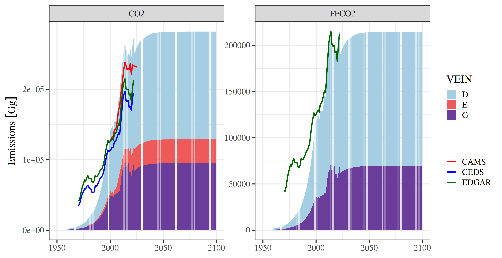
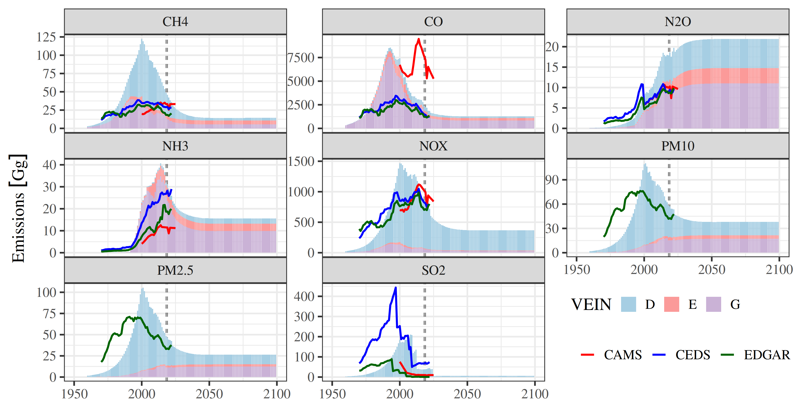
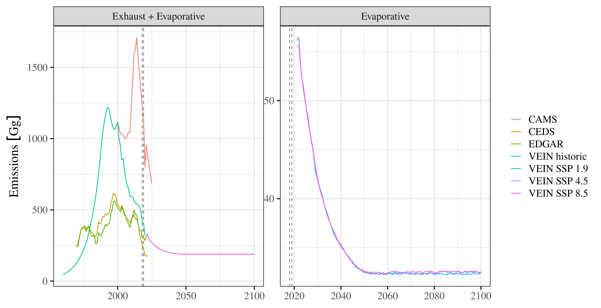
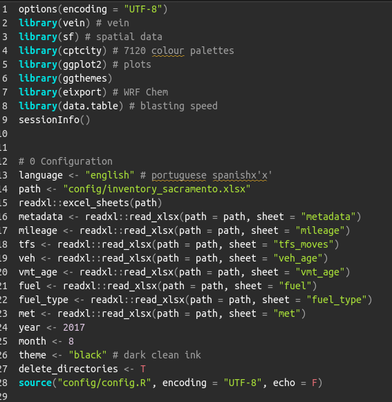
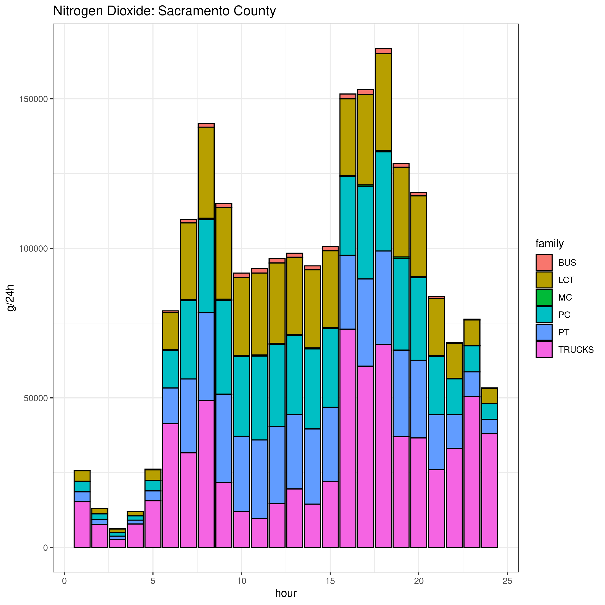

```{r setup, include=FALSE}
options(htmltools.dir.version = FALSE)
knitr::opts_chunk$set(
  fig.width=9, 
  fig.height=3.5, 
  fig.retina=3,
  out.width = "100%",
  cache = FALSE,
  echo = TRUE,
  message = FALSE, 
  warning = FALSE,
  hiline = TRUE
)
```

```{r xaringan-themer, include=FALSE, warning=FALSE}
library(xaringanthemer)
style_duo_accent(
  primary_color = "#1381B0",
  secondary_color = "#FF961C",
  inverse_header_color = "#FFFFFF"
)
library(vein)
library(data.table)
library(ggplot2)
library(mapview)
library(sf)
```


class: inverse center middle
## Unveiling the Impacts of Brazil's Unique Fuel Mix on Air Quality: A Century of Vehicular Emissions

> Sergio Ibarra-Espinosa¹'²
<br>
> 1 CIRES, University of Colorado-Boulder<br>
> 2 NOAA Global Monitoring Laboratory<br>
> sergio.ibarraespinosa@colorado.edu<br>

> Collaboratory for Air Quality Research (CAQR)
Department Mechanical Engineering
University of Colorado-Boulder


- extra slides: VEIN+MOVES in US, China, WRF Chem, Methane Emissions over US

---
class: centered inverse middle

> “Emission inventories are easily seen as the scapegoat if a mismatch is found between modelled and observed concentrations of air pollutants”. 

Pulles, Tim, and Dick Heslinga. "The art of emission inventorying." TNO, Utrecht (2010): 29-53.

---
# Emissions inventories

.pull-left[

## Global inventories

- Crippa et al., (2024) Emissions Database for Global Atmospheric Research (EDGAR) 1970-2023
- Feng at al., (2020) Community Emissions Data System (CEDS)
- Soulie et al., (2024) CAMS inventory 2000-2025

]

.pull-right[

## Regional inventories

- Osses et al (2022): Chile 1990-2020
- Rojas et al., (2023): Colombia 1990-2020
- MMA-Brazil, (2011): Brazil 1989-2020
- Hoinaski et al., (2022): Brazil 2013-2019
- Puliafito et al., (2021): Argentina 1995-2020

]


---

# History of road transportation in Brazil

.pull-left[
## Roads and cars

- Brazil has the biggest fleet in Latin America, with big problems in air pollution and congestion.
- In 1930s, President Getúlio Vargas initiated first large road projects, including the construction of the "Via Dutra" (Dutra Highway), which connected Rio de  Janeiro to São Paulo. 
- In 1950, President Kubitschek' Large-scale road construction began, aiming to attract the automotive industry.
- Volkswagen, Ford and General Motors arrived in Brasil .
- Today, fleet more than 200 million.


]

.pull-right[

## Cars


- First car produced in Brazil in 1955
- https://en.wikipedia.org/wiki/Isetta#Romi-Isetta_(Brazil)

]


---

# Fuel, fleet and technology

.pull-left[
## Fuel

- Gasoline contains 27% of ethanol.
- Diesel has 7% biodiesel
- In 2003, flex engine emerged, allowing any mix of gasoline or ethanol
- Ethanol is cheaper, but a bit less miles per gallon 
- In 2009, flex engines where incorporated into motorcycles
- Today, 76% of the fleet are flex vehicles

]

.pull-right[

## Fleet

- Light vehicles (PC, LCV, MC) with gasoline engine, with ethanol engine, and flex
- LCV vehicles also consume diesel
- Trucks consume diesel
- Buses consume mostly diesel
- Small participation: electric cars
- **Electric vehicles are less environmentally friendly than flex-fuel cars considering a broader analysis (de Oliveira et al., 2020)**.
- https://www.epa.gov/greenvehicles/electric-vehicle-myths
]


---
# Objectives

- Estimate vehicular emission in Brazil, 1960-2100
- Evaluate impact of Shared Socioeconomic Pathways on evaporative emissions
- Evaluate impacts on air quality during 2019
- Compare with Lichtig et al. (2024)

---
class: inverse center middle
# Data and methods

---

# Fuel

.pull-left[


- Fleet State of Sao Paulo 1979-2020 (CETESB, 2023)
- Mileage from Official vehicular inventory (CETESB, 2023)
- Monthly fuel consumption by state, 2000-2023 (ANP, 2023)

 $$ f(x)=\frac{L}{e^{-k(x - x_0)}} $$

]

.pull-right[

]

---

# Fleet and fuel in 2020

.pull-left[

]

.pull-right[


]


---
# Vehicular Emissions INventories  vein

.pull-left[

* build:
[](https://ci.appveyor.com/project/ibarraespinosa/vein)
[](https://codecov.io/github/atmoschem/vein?branch=master)
* cran:
[](http://cran.rstudio.com/web/packages/vein/index.html)
[](http://cran.r-project.org/web/packages/vein) 
[](http://cran.r-project.org/package=vein)
[](https://www.tidyverse.org/lifecycle/#maturing)

* doi:
[](https://zenodo.org/badge/latestdoi/88201850)
* github:
[](https://github.com/atmoschem/vein)


<!--  -->

[](https://github.com/atmoschem/vein/actions)

- R package to calculate vehicular emissions
- Includes Fortran subroutines with // OpenMP
- main paper: https://gmd.copernicus.org/articles/11/2209/2018/
- 64 citations [(2018)](https://scholar.google.com/scholar?oi=bibs&hl=en&cites=1650173053278606175)
- Detailed speciation applying Carter [(2015)](https://www.tandfonline.com/doi/full/10.1080/10962247.2015.1013646)
- YouTube Channel https://www.youtube.com/channel/UC2oYaS9mpnIDk8w55O8_bTg
- Emission factors based on real world measurements
 ]


.pull-right[


<image src="https://atmoschem.github.io/eixport/reference/figures/logo.gif" height="100">

<image src="https://github.com/atmoschem/respeciate/blob/main/man/figures/logo.png?raw=true" height="100">


]

---
# vein


---
# How to run vein (without knowing R)

.pull-left[
- Install and get a [project](https://atmoschem.github.io/vein/reference/get_project.html)

```{r, eval = F}
install.packages("vein")
library(vein)
?get_project
```
]

.pull-right[

<image src="figuras/vein_projects.jpg" height="500">


]

---

# MUSICA (ACOM NSF NCAR)

.pull-left[

- [MUSICA](https://wiki.ucar.edu/display/MUSICA/MUSICA+Home)
- The Multi-Scale Infrastructure for Chemistry and Aerosols (MUSICA) will become a 
  computationally feasible global modeling framework that allows for the simulation 
  of large-scale atmospheric phenomena, while still resolving chemistry at 
  emission and exposure relevant scales. 
- MUSICAv0 is a configuration of CAM-chem, the Community Atmosphere Model with chemistry,
  component of the Community Earth System Model (CESM). 
- Configuration: Spectral Element (SE) dynamical core, which allows for Regional 
  Refinement (RR), so is called CAM-chem-SE-RR, or MUSICAv0.  
- The chemical mechanism in MUSICA is  MOZART-TS1 (Emmons et al., 2020) 
- Aerosols Modal Aerosol Module (MAM4) with volatility bin set (VBS) (Liu et al., 2016; Tilmes et al., 2019).
]

.pull-right[

<image src="figuras/grids/grids.gif" height="400">

]

--- 
# Grid South America


```{r, echo = F, fig.align='center',  out.width='93%'}
knitr::include_graphics("figuras/o3mus5.png")
```

---

# VEIN + MUSICA

.pull-left[

## Emissions

- Fire INventory from NCAR version 2.5 (FINNv2.5) (Wiedinmyer,et al., 2023)
- CAMS (Soulie et al., 2023)
- Biogenic emissions the Model of Emissions of Gases and Aerosols from Nature (MEGAN) (Guenther et al., 2012). 
- Transportation Emisisons from VEIN In Brazil
]

.pull-right[
## Scenarios

1. MUSICA 2018 and 2019 with default emissions
2. MUSICA 2018 and 2019 with transportation from VEIN in Brazil and other elsewhere

]


---
class: inverse center middle
# Results

---
class: center middle




---
class: center middle



---
class: center middle


---
class: center middle





---
class: inverse center middle
# Is there a positive feedback with evaporative emissions?


---
# hockey-type curve


- Based on last figures, it seems that there is indeed a positive feedback
- The hotter the air, the more evaporative emissions, hence more global warming
- To investigate the breakpoints, we used Regression Model with Segmented Relationship(s)
- We used the R package segmented 
- Fasola S, Muggeo VMR, Kuchenhoff K. (2018). A heuristic, iterative
  algorithm for change-point detection in abrupt change models.
  Computational Statistics, 33, 997-1015.


---
class: center middle


---
class: center middle


---
class: inverse center middle
# Maps VEIN CAMS

---
class: center middle
#CO
.pull-left[


]

.pull-right[

]


---
class: center middle
#NOx
.pull-left[


]

.pull-right[

]


---
class: center middle
#alcohols
.pull-left[


]

.pull-right[

]


---
class: center middle
#acetylene
.pull-left[


]

.pull-right[

]


---
class: inverse center middle
# Some advances using MUSICA

---
## MUSICA run over South America

```{r, echo = F, fig.align='center',  out.width='93%'}
knitr::include_graphics("figuras/o3mus5.png")
```


---
class: inverse center middle
# Gracias!

.pull-left[
- https://ibarraespinosa.github.io/2025CU
- https://ibarraespinosa.github.io/
- sergio.ibarraespinosa@colorado.edu
- https://scholar.google.com.br/citations?user=8ohZGHEAAAAJ
- https://github.com/ibarraespinosa
- https://www.researchgate.net/profile/Sergio_Ibarra-Espinosa
- https://orcid.org/0000-0002-3162-1905

]

.pull-right[

]


---
class: center
## WRF Chemi using eixport


<video width="520" height="440" controls>
<source src="wrfc.mp4" type="video/mp4" height="550"/>
Your browser does not support the video tag.
</video>


---
class: inverse center middle
# Integration with US/EPA MOVES

---

## Recent Research: Integration of MOVES and VEIN:

- MOVES is the official vehicular emissions model for US. Runs on Windows, written in Java/SQL with MariaDB. VEIN is very versatile, ideal for traffic flow at streets. Currently has two approaches: 
- **1** Estimation using Windows with MOVES >3.0 installed. Emission factors are accessed using SQL in R.
- **2** Estimation using any OS. Emission factors are exported from Windows as .csv.gz and read with `data.table::fread`.
- Paper will be submitted to GMD (under development)

---
## Screenshots


```{r, eval = F, fig.align='center',  out.width='100%'}
vein::get_project(directory = "sacramento", case = "moves")
```


.pull-left[

```{r, echo = F, fig.align='center',  out.width='83%'}

```

]

.pull-right[
```{r, echo = F, fig.align='center', out.width='75%'}
knitr::include_graphics("figuras/moves1.png")
```

]
---

## Sacramento County 2017

.left-column[

- Traffic flow for a 4-stage travel demand model output for Sacramento Area, extracted for Sacramento County.'
- Traffic flow is for 2016 from CARB. 
- Traffic flow is total traffic volume 08:00-09:00.  
- Vehicular composition based on baltimore.
- Fuel consumption for 2017.
- Emission factors from Baltimore 2017.
- Temporal factors from hourly VMT MOVES Baltimore.
- Assumed BPR parameters.
]

.right-column[


```{r, echo = F, message = F, fig.align='center',  fig.height=6, fig.width=5}
net <- readRDS("rds/net.rds")
net <- st_transform(net, 4326)
mapview::mapview(net["PC"], 
                 color = cptcity::cpt(pal = "mpl_viridis"),
                 legend = FALSE)
```
]

---
class: center
## Speed parameters


.pull-left[

]

.pull-right[

]

---

## Emissions


.pull-left[

```{r, echo = F, fig.align='center',  out.width='93%'}
knitr::include_graphics("figuras/emisac.png")
```

]

.pull-right[

```{r, echo = F, fig.align='center',  out.width='93%'}

```

]
---


## Spatial Emissions


```{r, echo = F, message = F, fig.align='center',  fig.height=7, fig.width=6}
library(sf)
library(vein)
co <- readRDS("rds/pollutantID_2.rds")
l8 <- co[as.numeric(co$H8) > 0,"H8"]
g <- st_sf(
  geometry = st_make_grid(
    x = l8,
    cellsize = 3000, 
    square = F))
gco <- emis_grid(spobj = l8,
                 g = g)
grid <- gco[as.numeric(gco$H8) > 0,"H8"]
mapview::mapview(l8, 
                 col.regions = cptcity::cpt(pal = "mpl_inferno"),
                 legend = FALSE) + mapview::mapview(grid, 
                                                    legend = FALSE)
```


